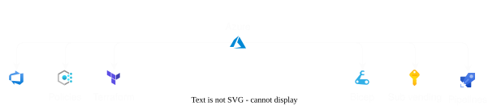

# Sunny Bharne, I do all things Azure.

###### A developer with a decade of experience | Helsinki, Finland.

---

### Expert: (Take it with a pinch of salt)

- Azure DevOps (Azure Pipelines, Azure DevOps Self-hosted agents, Azure Repos, Service Connections, etc. In short I know Azure DevOps quite well).
- Azure Platform IAC using [Bicep](https://github.com/sunnybharne/azure-enterprise-platform) and [Terraform](https://github.com/sunnybharne/azure-enterprise-platform) (Mostly HCL, catching up with cdktf)
- Azure subscription provisioning IAC. ([Platform Landing Zones](https://github.com/sunnybharne/azure-enterprise-platform), Standard Landing Zones, Shared Landing Zones).
- Azure Management Group structure provisioning IAC. (According to CAF and some of my own architectural thoughts)
- [Azure Policy](https://github.com/sunnybharne/azure-enterprise-platform) provisioning IAC. (According to CAF and some of my own architectural thoughts)
- Azure Policy release design with multiple release cycles. 
- Azure Platform Change Management using ServiceNow.
- Azure Platform Test Automation using Pester and Terraform testing tools.

### Past Life Skills:

- Test Automation using Selenium with Java.
- Test Automation framework development in Java.
- Java (Everything I did was in Java, hence I know Java quite well)
- Other SDLC terminologies and workflows that I don't remember now, regression, integration unit test automation to name a few.

---

###### I use [VIM](https://github.com/sunnybharne/nvim), Judge me!

---

### Latest from my YouTube — [@SunnySideCode](https://www.youtube.com/@SunnySideCode)

<!-- YOUTUBE:START -->
<table>
  <tr>
    <td align="center" width="33%"> <a href="https://www.youtube.com/watch?v=rPmby-3YCCc"><b>Why AI Made Me Give Up Vim and Return to VS Code</b></a> 854 · 9d ago</td>
    <td align="center" width="33%"> <a href="https://www.youtube.com/watch?v=awCupq9jkQ4"><b>Normal Coding Day | Building a New Email Client</b></a> 909 · 1mo ago</td>
    <td align="center" width="33%"> <a href="https://www.youtube.com/watch?v=aHygd83XVdU"><b>2026 Desk Setup Upgrade | Cockpit Mode</b></a> 207 · 2mo ago</td>
  </tr>
  <tr>
    <td align="center" width="33%"> <a href="https://www.youtube.com/watch?v=d3y5ABV5_34"><b>Claude vs Qwen 7B: Can a Local LLM Replace Claude?</b></a> 1.8K · 2mo ago</td>
    <td align="center" width="33%"> <a href="https://www.youtube.com/watch?v=RgUAUc-uL74"><b>A Real Coding Day: Building My First Mac App</b></a> 2.8K · 3mo ago</td>
    <td align="center" width="33%"> <a href="https://www.youtube.com/watch?v=8mTpQM1TAug"><b>Day in the Life of a Software Engineer in Finland</b></a> 2.1K · 3mo ago</td>
  </tr>
</table>

↑ latest from <a href="https://www.youtube.com/@SunnySideCode">@SunnySideCode</a>
<!-- YOUTUBE:END -->

---

